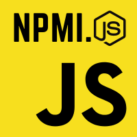

<!-- SHIELDS -->

[](https://www.npmjs.com/package/npmi.js)
[](https://github.com/Mateo-Wallace/npmi.js/stargazers)
[](https://github.com/Mateo-Wallace/npmi.js/network/members)
[](https://github.com/Mateo-Wallace/npmi.js/graphs/contributors)
[](https://github.com/Mateo-Wallace/npmi.js/blob/main/LICENSE)
[](https://www.linkedin.com/in/mateo-wallace/)

<!-- PROJECT LOGO & HEADER -->
<br />
<div align="center">


  <h3 align="center"><strong>npmi.js</strong></h3>

  <p align="center">
    <strong>A multi-folder npm installer</strong>
    <br />
    Globally install npmi.js and run npmijs to install all folders that have a package.json in the cwd
    <br />
    <br />
    <a href="https://github.com/Mateo-Wallace/npmi.js">View GitHub</a>
    ·
    <a href="https://www.npmjs.com/package/npmi.js">View npm</a>
    ·
    <a href="https://github.com/Mateo-Wallace/npmi.js/issues">Report Bug</a>
  </p>
</div>

<!-- NPM INSTALL -->

```
npm install -g npmi.js
```
